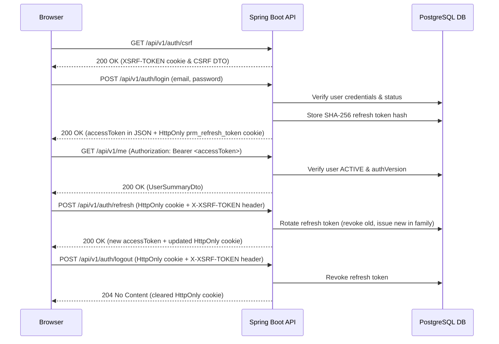

# Authentication API Documentation

This document describes the authentication and user self-service API endpoints for **Property Rental Manager**.

---

## 1. Authentication Flow Overview



---

## 2. Endpoints Summary

| Method | Endpoint | Authentication | CSRF Header | Description |
|---|---|---|---|---|
| `GET` | `/api/v1/auth/csrf` | Public | None | Injects / returns CSRF token and sets `XSRF-TOKEN` cookie |
| `POST` | `/api/v1/auth/login` | Public | Ignored | Authenticates user credentials, issues JWT access token & HttpOnly refresh cookie |
| `POST` | `/api/v1/auth/refresh` | Cookie (`prm_refresh_token`) | Required (`X-XSRF-TOKEN`) | Rotates refresh token, issues new JWT access token |
| `POST` | `/api/v1/auth/logout` | Cookie (`prm_refresh_token`) | Required (`X-XSRF-TOKEN`) | Revokes refresh token session and clears HttpOnly cookie |
| `GET` | `/api/v1/me` | Bearer Token | None | Retrieves authenticated user profile summary |
| `POST` | `/api/v1/me/password` | Bearer Token | None | Changes current user password, invalidates all sessions, bumps `authVersion` |

---

## 3. Detailed Endpoint Contracts

### 3.1 Fetch CSRF Token
`GET /api/v1/auth/csrf`

#### Response (200 OK)
```json
{
  "headerName": "X-XSRF-TOKEN",
  "parameterName": "_csrf",
  "token": "a92f5c26-7ce0-40fc-944e-759156df23bd"
}
```

---

### 3.2 Login
`POST /api/v1/auth/login`

#### Request Body
```json
{
  "email": "admin@example.com",
  "password": "AdminPassword123!"
}
```

#### Response (200 OK)
Sets Cookie: `prm_refresh_token=<rawOpaqueToken>; Path=/api/v1/auth; HttpOnly; SameSite=Lax`

```json
{
  "accessToken": "eyJhbGciOiJIUzUxMiJ9...",
  "tokenType": "Bearer",
  "expiresIn": 900,
  "user": {
    "id": "a1449c07-eae6-4f45-86ae-ffb2a322e680",
    "email": "admin@example.com",
    "fullName": "Administrator",
    "status": "ACTIVE",
    "preferredLocale": "pl",
    "roles": [
      "ADMIN"
    ]
  }
}
```

---

### 3.3 Token Refresh
`POST /api/v1/auth/refresh`

Requires:
- HttpOnly Cookie: `prm_refresh_token=<token>`
- HTTP Header: `X-XSRF-TOKEN: <csrfToken>`

#### Response (200 OK)
Sets updated Cookie: `prm_refresh_token=<newRawToken>; Path=/api/v1/auth; HttpOnly; SameSite=Lax`

```json
{
  "accessToken": "eyJhbGciOiJIUzUxMiJ9...",
  "tokenType": "Bearer",
  "expiresIn": 900,
  "user": {
    "id": "a1449c07-eae6-4f45-86ae-ffb2a322e680",
    "email": "admin@example.com",
    "fullName": "Administrator",
    "status": "ACTIVE",
    "preferredLocale": "pl",
    "roles": [
      "ADMIN"
    ]
  }
}
```

---

### 3.4 Current User Profile
`GET /api/v1/me`

Requires:
- HTTP Header: `Authorization: Bearer <accessToken>`

#### Response (200 OK)
```json
{
  "id": "a1449c07-eae6-4f45-86ae-ffb2a322e680",
  "email": "admin@example.com",
  "fullName": "Administrator",
  "status": "ACTIVE",
  "preferredLocale": "pl",
  "roles": [
    "ADMIN"
  ]
}
```

---

### 3.5 Change Own Password
`POST /api/v1/me/password`

Requires:
- HTTP Header: `Authorization: Bearer <accessToken>`

#### Request Body
```json
{
  "currentPassword": "AdminPassword123!",
  "newPassword": "NewSecurePassword456!"
}
```

#### Response (204 No Content)
Sets Cookie: `prm_refresh_token=; Max-Age=0`

---

## 4. Error Codes & Format

All error responses use the standard `ApiErrorResponse` format established in Stage 3:

```json
{
  "code": "INVALID_CREDENTIALS",
  "message": "Invalid email or password",
  "fieldErrors": [],
  "requestId": "1d2e7f2d-c7c3-4b38-8999-409e20c6f408",
  "timestamp": "2026-08-08T20:00:10.755Z",
  "path": "/api/v1/auth/login"
}
```

### Key Error Codes
- `INVALID_CREDENTIALS` (401): Generic rejection for invalid email, wrong password, or disabled account.
- `AUTHENTICATION_REQUIRED` (401): Missing or unauthenticated Bearer token.
- `TOKEN_EXPIRED` (401): Access token expired.
- `REFRESH_TOKEN_INVALID` (401): Refresh token is missing, invalid, or revoked.
- `REFRESH_TOKEN_REUSE_DETECTED` (401): Attempted reuse of a previously rotated refresh token; all family sessions revoked.
- `RATE_LIMIT_EXCEEDED` (429): Exceeded 5 failed login attempts per 15 minutes. Includes `Retry-After` header.
- `PASSWORD_POLICY_VIOLATION` (400): Password fails length rules (< 12 or > 128 chars) or matches current password.
