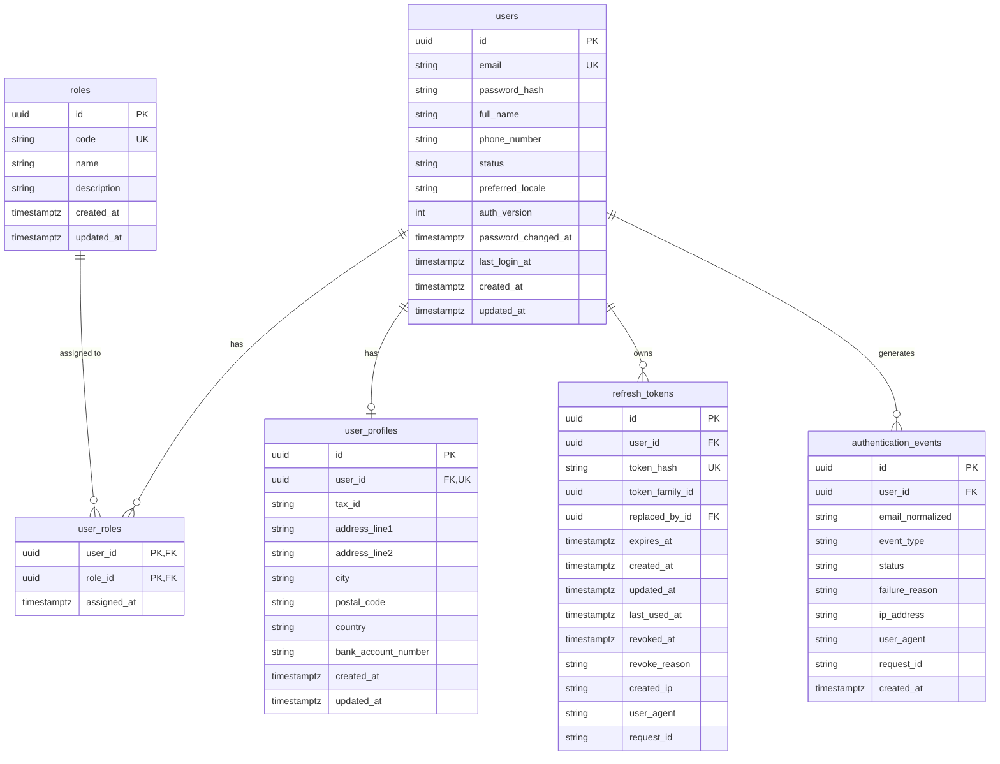

# Entity Relationship Diagram (ERD) — Property Rental Manager

This document contains the domain data model for **Property Rental Manager**.

---

## Mermaid ERD

```mermaid
erDiagram
    users ||--o{ user_roles : "has"
    roles ||--o{ user_roles : "assigned to"
    users ||--o| user_profiles : "has"
    users ||--o{ refresh_tokens : "owns"
    users ||--o{ authentication_events : "generates"

    users {
        uuid id PK
        string email UK
        string password_hash
        string full_name
        string phone_number
        string status
        string preferred_locale
        int auth_version
        timestamptz password_changed_at
        timestamptz last_login_at
        timestamptz created_at
        timestamptz updated_at
    }

    roles {
        uuid id PK
        string code UK
        string name
        string description
        timestamptz created_at
        timestamptz updated_at
    }

    user_roles {
        uuid user_id PK, FK
        uuid role_id PK, FK
        timestamptz assigned_at
    }

    user_profiles {
        uuid id PK
        uuid user_id FK, UK
        string tax_id
        string address_line1
        string address_line2
        string city
        string postal_code
        string country
        string bank_account_number
        timestamptz created_at
        timestamptz updated_at
    }

    refresh_tokens {
        uuid id PK
        uuid user_id FK
        string token_hash UK
        uuid token_family_id
        uuid replaced_by_id FK
        timestamptz expires_at
        timestamptz created_at
        timestamptz updated_at
        timestamptz last_used_at
        timestamptz revoked_at
        string revoke_reason
        string created_ip
        string user_agent
        string request_id
    }

    authentication_events {
        uuid id PK
        uuid user_id FK
        string email_normalized
        string event_type
        string status
        string failure_reason
        string ip_address
        string user_agent
        string request_id
        timestamptz created_at
    }
```
