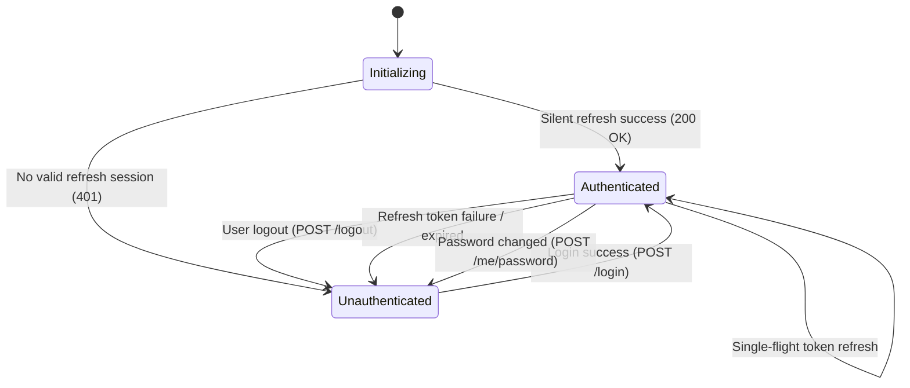

# Frontend Architecture — Stage 5 Foundation

This document outlines the architecture, state management, routing, and design system of the React 19 + TypeScript frontend application (`core/frontend/`).

---

## 1. Directory Structure (`src/`)

```
src/
├── api/
│   ├── apiClient.ts          # Central fetch client, memory token, CSRF, single-flight refresh
│   └── authApi.ts            # Auth & profile endpoint functions
│
├── auth/
│   ├── AuthContext.ts        # AuthContext definition
│   ├── AuthProvider.tsx      # AuthState provider & session bootstrap
│   └── useAuth.ts            # Custom hook for auth context
│
├── components/
│   └── common/               # Design system UI components (Button, Input, FormField, Card, Alert, Spinner, etc.)
│
├── i18n/
│   ├── i18n.ts               # i18next configuration with LanguageDetector
│   └── locales/              # Translation files (pl.json, en.json)
│
├── layouts/
│   ├── AuthLayout.tsx        # Centered auth card layout
│   └── DashboardLayout.tsx   # Dashboard shell with responsive navigation, header, sidebar
│
├── pages/
│   ├── auth/LoginPage.tsx
│   ├── dashboard/
│   │   ├── AdminDashboardPage.tsx
│   │   ├── OwnerDashboardPage.tsx
│   │   ├── TenantDashboardPage.tsx
│   │   └── DashboardDispatcherPage.tsx
│   ├── profile/ProfilePage.tsx
│   └── errors/
│       ├── ForbiddenPage.tsx (403)
│       ├── NotFoundPage.tsx (404)
│       └── GenericErrorPage.tsx (ErrorBoundary)
│
├── routes/
│   ├── router.tsx            # Locale-aware React Router configuration
│   ├── ProtectedRoute.tsx    # Session & authentication guard
│   ├── RoleRoute.tsx         # Role-based UX route guard
│   └── LocaleValidator.tsx   # Path locale validator (pl/en)
│
├── themes/
│   ├── ThemeContext.ts       # Theme context definition
│   ├── ThemeProvider.tsx     # Light/Dark mode provider
│   └── useTheme.ts           # Custom hook for theme management
│
├── types/
│   └── auth.ts               # TypeScript interfaces for auth, API errors, roles, locales
│
├── main.tsx                  # Application root entry point
└── index.css                 # CSS custom property tokens & design system
```

---

## 2. Authentication Lifecycle State Diagram



---

## 3. Key Components & Responsibilities

1. **`apiClient.ts`**: Holds `memoryAccessToken` in memory variable. Manages CSRF token header (`X-XSRF-TOKEN`). Implements single-flight request queue for 401 refresh retries.
2. **`AuthProvider.tsx`**: Manages top-level application auth status (`INITIALIZING`, `AUTHENTICATED`, `UNAUTHENTICATED`). Performs silent bootstrap on startup.
3. **`ProtectedRoute.tsx`**: Prevents unauthenticated access while displaying a clean loading screen during initialization (eliminating login page flashes).
4. **`RoleRoute.tsx`**: Provides UX filtering for `ADMIN`, `OWNER`, and `TENANT` roles (with `BACKEND AUTHORIZATION REMAINS AUTHORITATIVE` principle).
5. **`DashboardDispatcherPage.tsx`**: Resolves role-specific landing shells and allows multi-role users to toggle context seamlessly.
