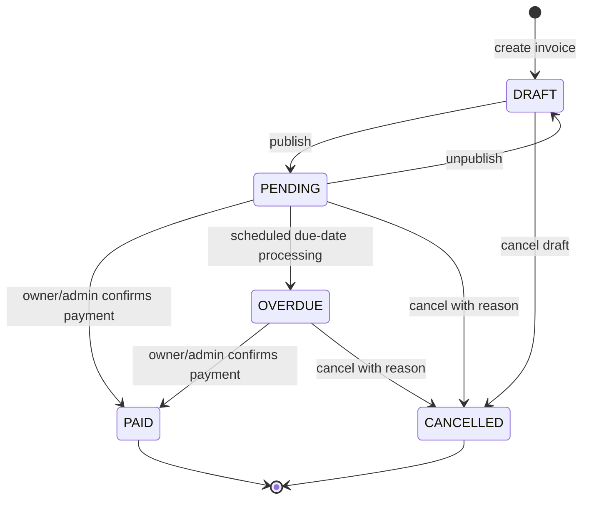

# Property Rental Manager — Invoice Lifecycle and Publication Rules

> **Document status:** Approved proposal for Stage 0 review

## 1. State model



## 2. Status semantics

| Status | Meaning | Tenant visibility |
|---|---|---|
| `DRAFT` | Work in progress; not published. | Never visible. |
| `PENDING` | Published and payable/not yet confirmed paid. | Visible only when tenancy-applicable. |
| `OVERDUE` | Published invoice whose due date has passed while still pending. | Visible only when tenancy-applicable. |
| `PAID` | Owner or admin confirmed payment. | Visible only when tenancy-applicable. |
| `CANCELLED` | Invoice is void, duplicate or invalid. | Visible when it had previously been published and is tenancy-applicable. |

## 3. Publication invariant

The MVP uses the following invariant:

```text
DRAFT      => is_published = false
PENDING    => is_published = true
OVERDUE    => is_published = true
PAID       => is_published = true
CANCELLED  => preserves whether the invoice was previously published
```

Publishing is a business operation, not a generic field update.

## 4. Allowed operations

### 4.1 Create

- owner/admin creates invoice for an authorized property,
- initial status is `DRAFT`,
- `is_published = false`,
- files may be added or removed,
- invoice is invisible to tenants.

### 4.2 Publish

Preconditions:

- current status is `DRAFT`,
- required metadata is valid,
- at least one file is attached when attachment policy requires it,
- actor can manage the property,
- billing-period dates are valid.

Effects:

- status becomes `PENDING`,
- `is_published = true`,
- `published_at` is set,
- audit event `invoice.published` is created,
- in-app notification may be created for applicable tenants.

### 4.3 Unpublish

Preconditions:

- current status is `PENDING`,
- actor can manage the property.

Effects:

- status becomes `DRAFT`,
- `is_published = false`,
- tenant access is removed immediately,
- audit event `invoice.unpublished` is created.

Unpublish is not allowed from `OVERDUE`, `PAID` or `CANCELLED`.

### 4.4 Mark paid

Preconditions:

- current status is `PENDING` or `OVERDUE`,
- actor is owner of the property or admin.

Effects:

- status becomes `PAID`,
- audit event `invoice.marked_paid` is created,
- optional `paid_at` and `paid_by` metadata may be stored.

Tenant cannot perform this operation.

### 4.5 Cancel

Preconditions:

- status is `DRAFT`, `PENDING` or `OVERDUE`,
- non-empty cancellation reason,
- actor can manage the invoice.

Effects:

- status becomes `CANCELLED`,
- the historical record is retained,
- prior publication visibility is preserved,
- audit event includes the cancellation reason.

### 4.6 Automatic overdue

The scheduler processes invoices that satisfy:

```sql
status = 'PENDING'
AND is_published = true
AND payment_due_date < CURRENT_DATE
```

Effects:

- status becomes `OVERDUE`,
- audit event `invoice.marked_overdue` is created,
- in-app notification may be created,
- processing is idempotent.

## 5. Validation rules

- amount must be greater than zero,
- currency must be a supported ISO 4217 code,
- due date cannot be before issue date unless a documented exception is added,
- billing-period end cannot be before billing-period start,
- property must be active when publishing a new invoice,
- linked tenancy must belong to the same property,
- generic PATCH cannot directly set protected workflow fields,
- status transitions occur through dedicated endpoints/services.

## 6. Attachment rules by state

| State | Add file | Owner remove file | Admin emergency removal |
|---|---:|---:|---:|
| `DRAFT` | Yes | Yes | Yes |
| `PENDING` | Yes, audited | No | Yes, reason required |
| `OVERDUE` | Yes, audited | No | Yes, reason required |
| `PAID` | Yes only if policy allows supplementary evidence | No | Yes, reason required |
| `CANCELLED` | No normal upload | No | Yes, reason required |

## 7. Required tests

- valid and invalid transitions,
- publish sets visibility fields,
- unpublish removes tenant visibility,
- scheduler ignores draft, paid and cancelled invoices,
- scheduler is idempotent,
- tenant cannot trigger workflow operations,
- owner cannot change another owner’s invoice,
- cancelled published invoice remains visible to an applicable tenant,
- cancelled draft remains invisible.
